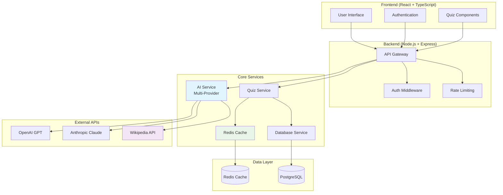
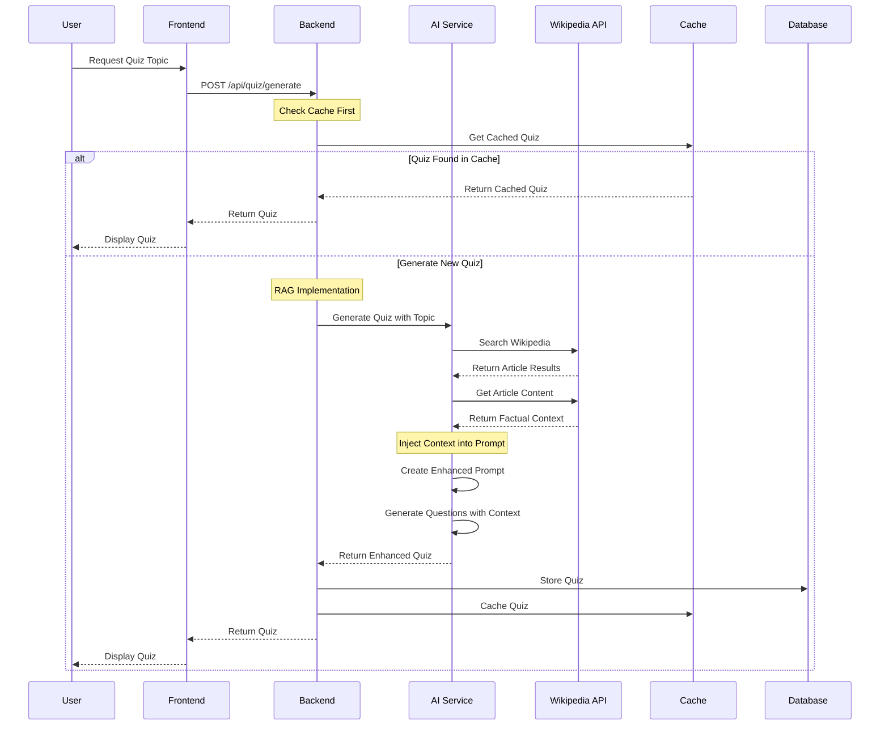
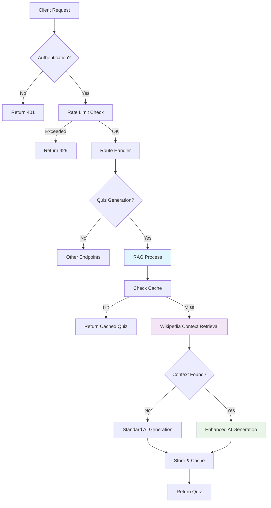
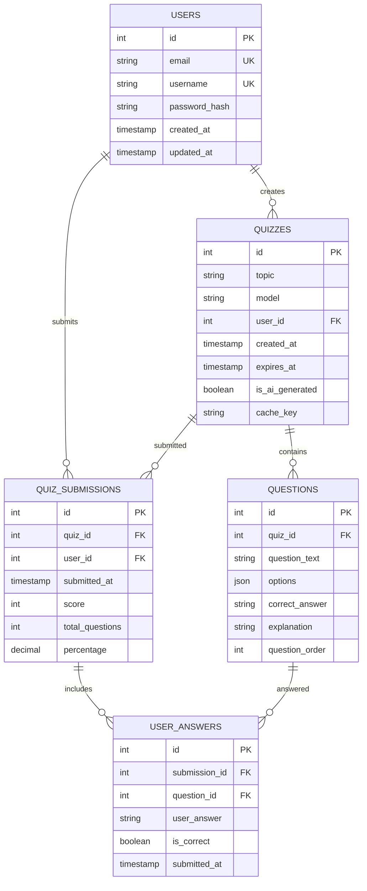
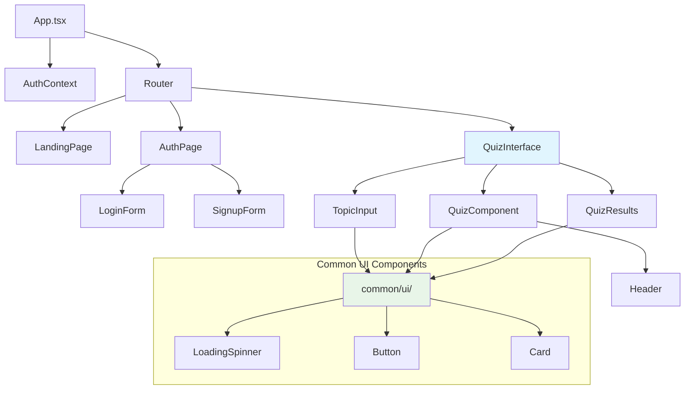
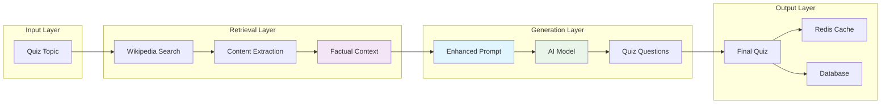
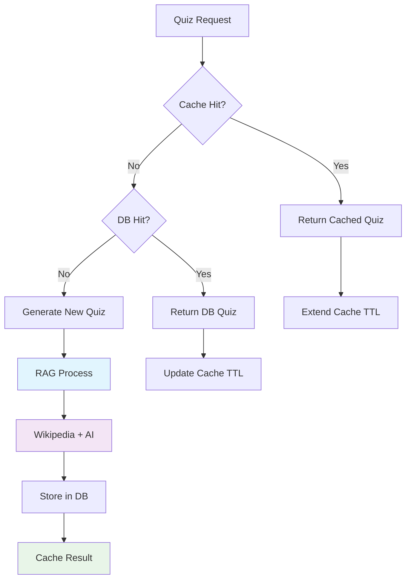
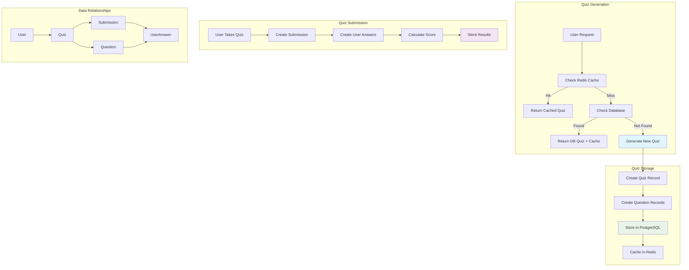

# 🏗️ System Architecture Diagrams

This document contains essential diagrams to help developers and stakeholders understand the AI Quiz App architecture and the new RAG implementation.

## 🎯 **1. System Architecture Overview**

## 🔍 **2. RAG (Retrieval-Augmented Generation) Flow**

## 🌊 **3. API Request Flow**

## 🗄️ **4. Database Schema**

## 🎨 **5. Frontend Component Hierarchy**

## 🔄 **6. Data Flow in RAG System**

## 📊 **7. Performance & Caching Strategy**

## 🗃️ **8. Database Operations Flow**

## 🔍 **Key Schema Improvements & Design Decisions**

### **Current Schema Features**
1. **User Management**: Proper authentication with username/email uniqueness
2. **Quiz Tracking**: AI generation metadata and cache key tracking
3. **Question Ordering**: Structured question sequence for better UX
4. **Submission Analytics**: Comprehensive scoring and percentage tracking
5. **Answer Validation**: Individual answer tracking with correctness flags

### **Database Design Strengths**
- **Normalized Structure**: Proper relationships without data duplication
- **Audit Trail**: Timestamps on all major operations
- **Flexible Options**: JSON storage for question options
- **Cascade Deletion**: Proper cleanup when quizzes are removed
- **Performance Indexes**: Unique constraints on email/username

### **Data Flow Highlights**
- **Quiz Generation**: RAG → Database → Cache → User
- **Quiz Taking**: User → Questions → Answers → Scoring
- **Analytics**: Submission tracking for user progress
- **Caching**: Redis for performance, PostgreSQL for persistence

## 🎯 **Key Architecture Points**

### **Architecture Strengths**
1. **Separation of Concerns**: Clear service boundaries
2. **Scalability**: Redis caching, database optimization
3. **Security**: Authentication, rate limiting, input validation
4. **Maintainability**: TypeScript, modular structure

### **RAG Implementation Highlights**
1. **Factual Accuracy**: Wikipedia integration for current information
2. **Reduced Hallucination**: Questions grounded in verified sources
3. **Source Attribution**: Wikipedia sources provided for transparency
4. **Configurable Feature**: Can be enabled/disabled via environment variable

### **Technical Decisions**
1. **Multi-AI Provider**: OpenAI, Anthropic, Google support
2. **Database Design**: Prisma ORM with proper relationships
3. **Frontend Architecture**: Reusable components and contexts
4. **Error Handling**: Comprehensive logging and user feedback

These diagrams provide a complete picture of your system's architecture, showcasing the complexity and quality of your implementation.
