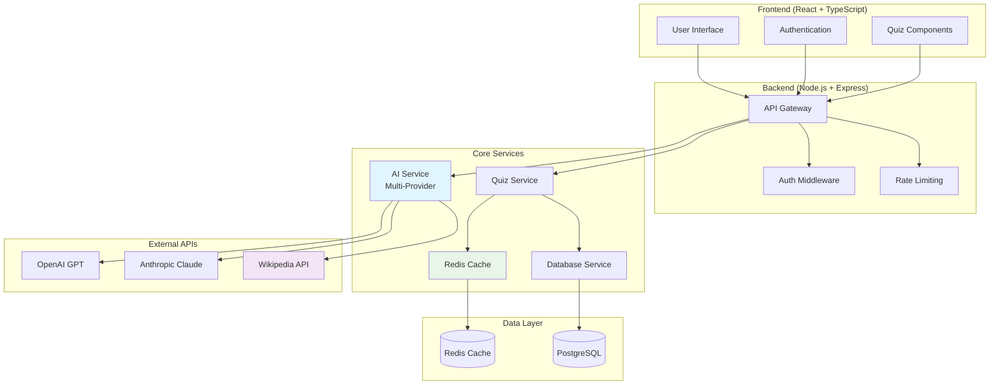
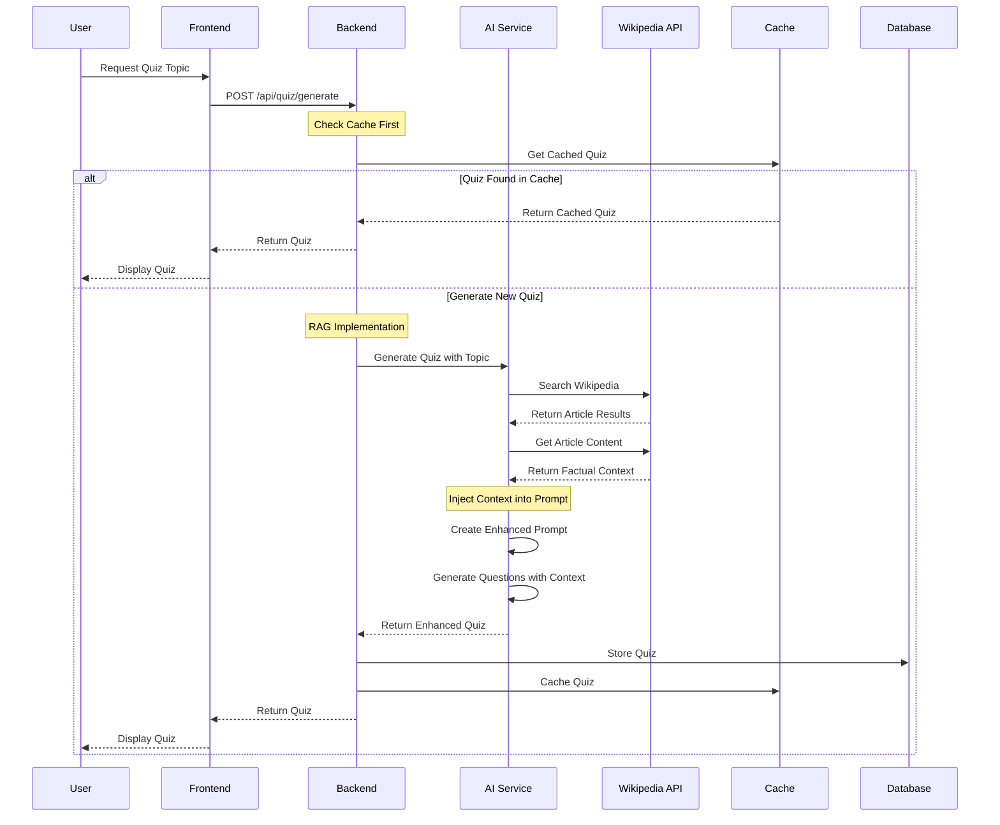
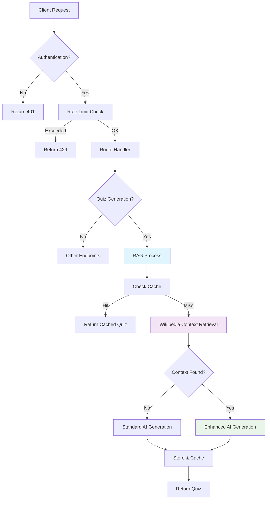
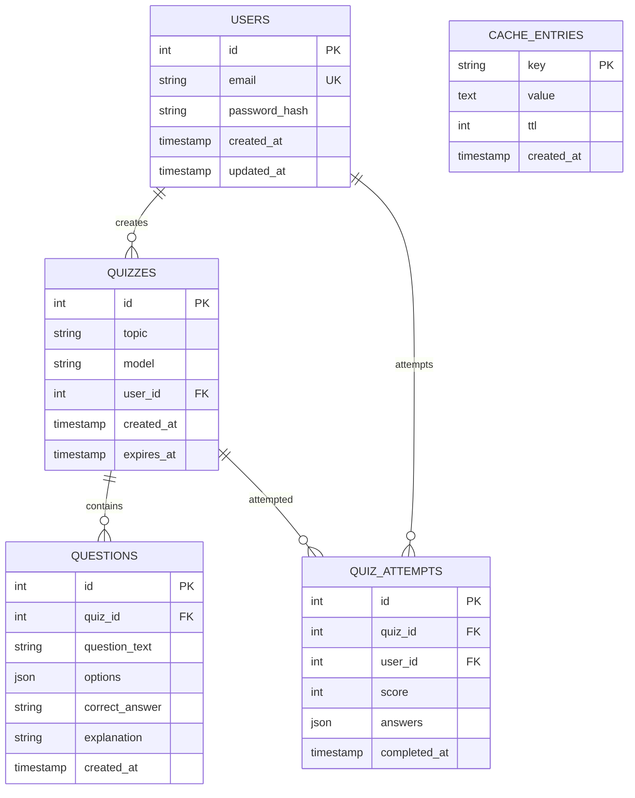
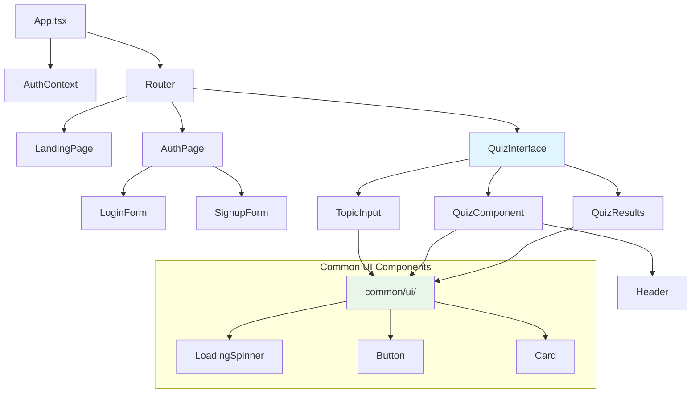
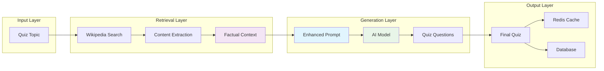
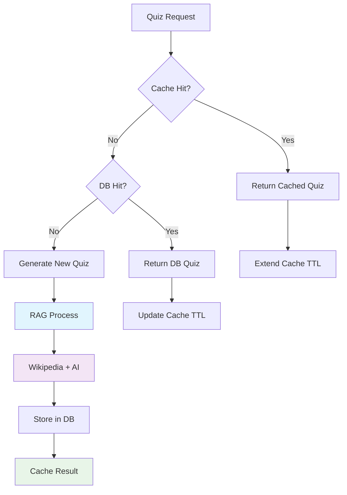

# 🏗️ System Architecture Diagrams

This document contains essential diagrams to help interviewers understand the AI Quiz App architecture and the new RAG implementation.

## 🎯 **1. System Architecture Overview**

## 🔍 **2. RAG (Retrieval-Augmented Generation) Flow**

## 🌊 **3. API Request Flow**

## 🗄️ **4. Database Schema**

## 🎨 **5. Frontend Component Hierarchy**

## 🔄 **6. Data Flow in RAG System**

## 📊 **7. Performance & Caching Strategy**

